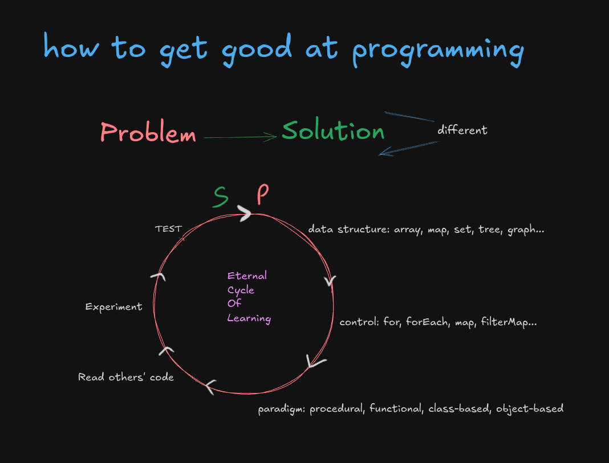

# gilded_rose

Regular practice exercises.

- Regular
- Exercises
- Regularly solve problems in different ways.

> I came to know about getting better at programming via coding kata.
>
> I came to know about coding kata via gilded-rose kata.

## Eternal Cycle Of Learning

Also known as `how to git gud`

## Companion videos

- [software-development @wtasyt](https://www.youtube.com/playlist?list=PLbUtscuRQ61xiGmjCL00Ime9z5sJEZu4M)
