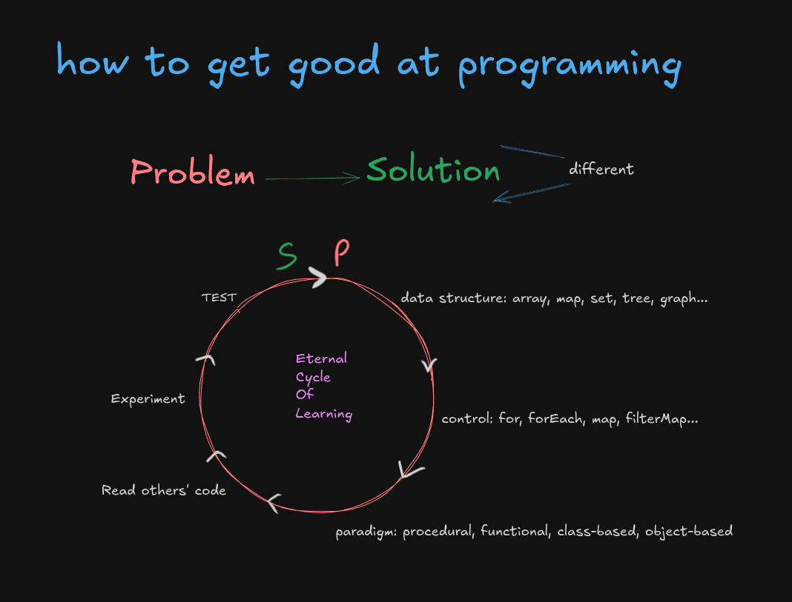

# gilded_rose

Regular practice exercises.

- Regular
- Exercises
- Regularly solve problems in different ways.

> I came to know about getting better at programming via coding kata.
>
> I came to know about coding kata via gilded-rose kata.

## structure

.
├── named-algorithms.md
├── aoc2025
├── docs
├── ecol.png
├── graph
├── l33tc0d3
├── leetcode-go.md
├── lessons
├── lists
├── markdownlint.json
├── nodejs
├── quiz
├── README.md
└── tsconfig.json

## Eternal Cycle Of Learning

Also known as `how to git gud`

