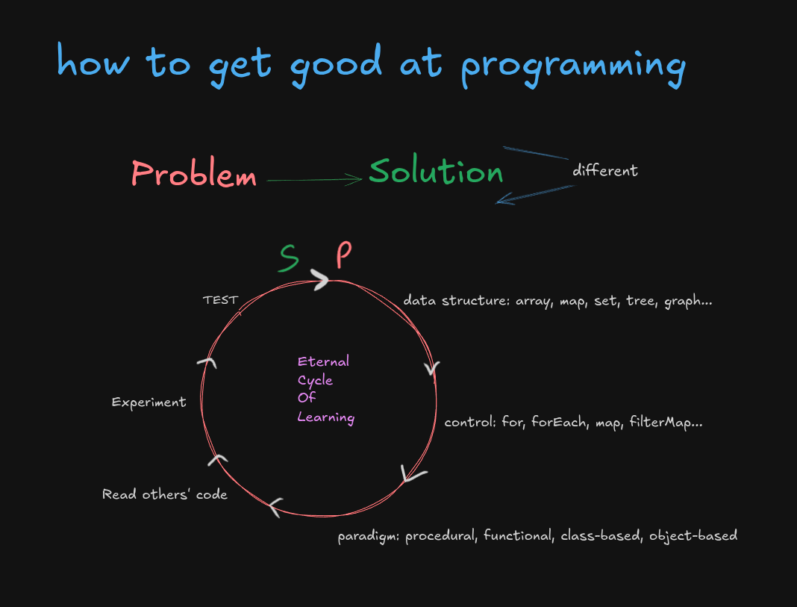

# gilded_rose

My personal (ir)regular practice exercises and solutions.

- Regular
- Exercises
- Regularly solve problems in different ways.

**Why Gilded Rose?**

> I came to know about getting better at programming via coding kata.
>
> I came to know about coding kata via gilded-rose kata.

## Eternal Cycle Of Learning

Also known as `how to git gud`



## Lessons

1. Branchless is fast. Branchless is best.
2. DRY logic. Remember the context. There are only 26 letters in alphabet.
3. Find a way to map problem onto known methods.
4. Fast is better; than non-working high-quality code.
5. Ugly is better; than non-working clean-code.
6. Bruteforce is better; than not solving a problem.

## Resources

1. [Tim Roughgarden YT channel](https://www.youtube.com/@timroughgardenlectures1861/playlists)
2. [3B1b website](https://www.3blue1brown.com/) | [3B1B YT channel](https://www.youtube.com/c/3blue1brown)

---

## python environment

```bash
python3 -m venv .venv
# add .venv to .gitignore

source ./.venv/bin/activate

pip install --upgrade pip

pip install --upgrade jupyterlab-lsp jupyterlab-git pyrefly ruff ipywidgets jupytext nbdime graphviz plotly rich tqdm memory-profiler line-profiler pyinstrument polars orjson tiktoken transformers sentence-transformers datasets accelerate jupyterlab basedpyright pdf_oxide pdftext cookiecutter pip tensorflow tensorboard manim

## because life is short, install everything today and ignore warnings

jupyter lab --log-level=ERROR ./nlp-engineer
```
