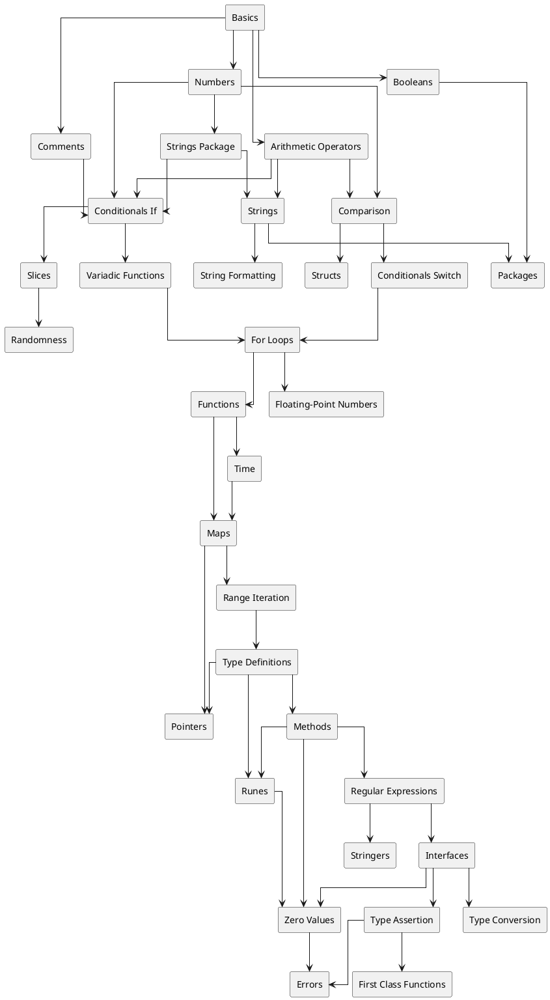
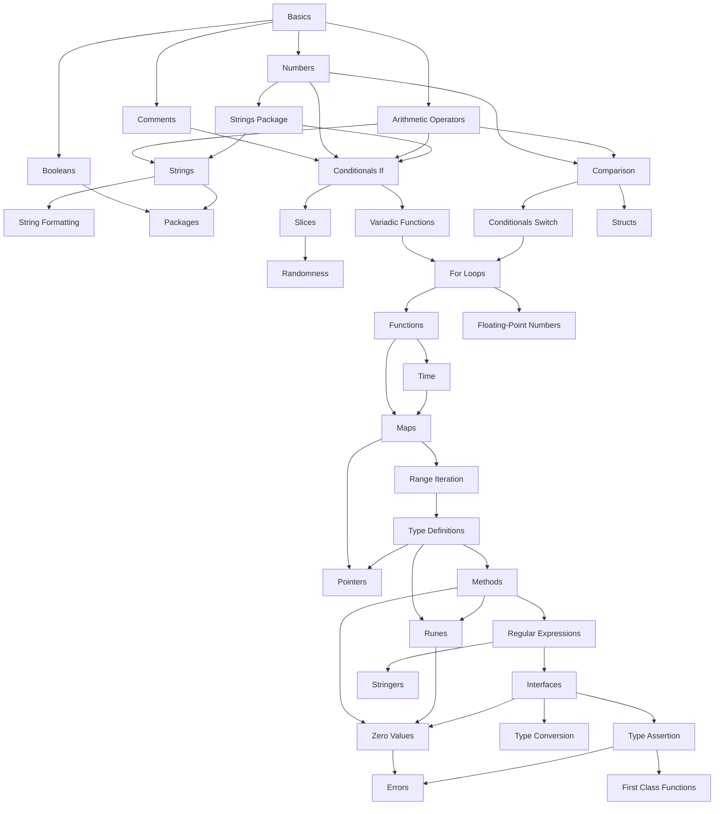

# Go

## hello world

```go
import "fmt"

func main() {
    fmt.Println("hello, world")
}
```





The diagrams above are AI generated and the data is taken from exercism.org

## basics

Statically typed, compiled programming language.

### packages

Apps are composed of packages; a package is bunch of files in one directory. All files in a directory/package belong to one package and there can be only one package in a directory. Subdirectories are internal packages for composition.

Private members' names are `camelCase` and public members are `PascalCase`. 

### Variables

+ Must have type info at compile time.
+ Types can be explicit or implicit.
+ Variable's type cannot change.
+ constans are created via `const` keyword.

### functions

+ Arity: 0+
+ Parameters have types and cannot be implicit.
+ function return type is listed before `{`.

## numbers

How to divide a number by two and get a float?

```go
n := 5
h := float64(n)/2 // h == 2.5
```

How to divide a number by two and get integer quotient?

```go
n := 5
q := n/2 // q == 2
// also
q := int(n)/2
```

## strings

