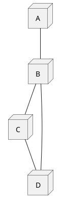
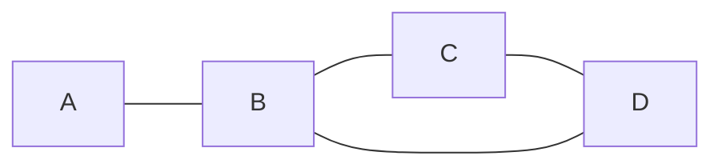
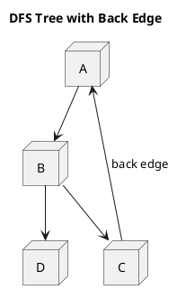
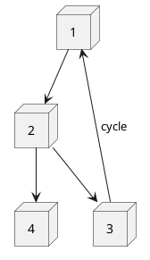
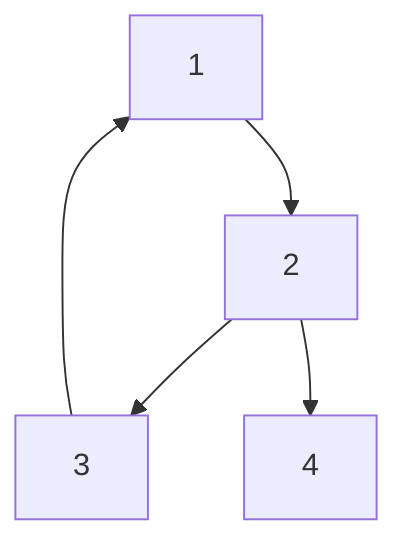

# Lesson: Cycle Detection in Graphs (DFS & BFS)

## 1. Theory

A **cycle** in a graph is a path that starts and ends at the same vertex, with all edges distinct and no vertex repeated (except the start/end). Detecting cycles is crucial for many applications: deadlock detection, dependency resolution, network analysis, etc.

| Graph Type | Cycle Definition | Detection Approach |
| ------------ | ------------------ | --------------------- |
| **Undirected** | Any path where a vertex is visited twice without using the immediate parent edge. | DFS / BFS with **parent tracking** |
| **Directed** | A path that follows direction and returns to a vertex. | DFS with **recursion stack** or BFS via **Kahn's algorithm** (topological sort) |

---

## 2. Cycle Detection Algorithms

### 2.1 DFS for Undirected Graphs

- Maintain `visited[]` and `parent[]`.
- When exploring neighbor `v` of current node `u`:
  - If `v` not visited → recurse.
  - If `v` visited **and** `v != parent[u]` → cycle found.

**Pseudocode**:

```js
function hasCycleDFS(u, parent):
    visited[u] = true
    for each neighbor v of u:
        if not visited[v]:
            if hasCycleDFS(v, u) returns true → return true
        else if v != parent:
            return true
    return false
```

### 2.2 DFS for Directed Graphs

- Maintain `visited[]` and `recStack[]` (nodes in current recursion path).
- When visiting neighbor `v`:
  - If not visited → recurse.
  - If `v` is in `recStack` → cycle found.

**Pseudocode**:

```js
function hasCycleDFS(u):
    visited[u] = true
    recStack[u] = true
    for each neighbor v of u:
        if not visited[v]:
            if hasCycleDFS(v) returns true → return true
        else if recStack[v] is true:
            return true
    recStack[u] = false
    return false
```

### 2.3 BFS (Kahn’s Algorithm) for Directed Graphs

- Compute indegree of all vertices.
- Push all vertices with indegree 0 into a queue.
- While queue not empty:
  - Pop node, add to topological order.
  - For each neighbor, decrement indegree; if indegree becomes 0, push it.
- If count of popped nodes ≠ total vertices → cycle exists.

**Pseudocode**:

```js
function hasCycleBFS(n, graph):
    indegree = [0] * n
    for each u in 0..n-1:
        for each v in graph[u]:
            indegree[v]++
    queue = all u with indegree[u] == 0
    count = 0
    while queue not empty:
        u = queue.pop()
        count++
        for each v in graph[u]:
            indegree[v]--
            if indegree[v] == 0:
                queue.push(v)
    return count != n
```

### 2.4 BFS for Undirected Graphs

- Use a queue storing `(node, parent)`.
- When exploring neighbor `v` of `(u, parent)`:
  - If `v` not visited → mark visited, push `(v, u)`.
  - If `v` visited **and** `v != parent` → cycle.

**Pseudocode**:

```js
function hasCycleBFS(start):
    queue = [(start, -1)]
    visited[start] = true
    while queue not empty:
        u, parent = queue.pop()
        for each v in graph[u]:
            if not visited[v]:
                visited[v] = true
                queue.append((v, u))
            else if v != parent:
                return true
    return false
```

---

## 3. PlantUML Diagrams

### 3.1 Undirected Graph with a Cycle





### 3.2 DFS Tree with Back Edge (Directed)




### 3.3 BFS (Kahn) – Cycle Detected





*Kahn’s algorithm will not process all vertices because indegree of 1 never becomes 0.*

---

## 4. Theoretical Questions

1. **Why does the parent check work for undirected graphs but not for directed graphs?**  
   *In undirected graphs, an edge `(u,v)` is the same as `(v,u)`. The parent check avoids treating the edge back to the parent as a cycle. In directed graphs, a back edge to a parent is still a cycle because direction matters.*

2. **What is the time complexity of DFS-based cycle detection for both graph types?**  
   *O(V + E) using adjacency list, O(V²) using adjacency matrix.*

3. **How does Kahn’s algorithm detect a cycle in a directed graph without using DFS?**  
   *If a cycle exists, no vertex in the cycle has indegree 0, so they will never be enqueued. After processing all possible sources, some vertices remain unvisited → cycle.*

---

## 5. Interview Questions

### Easy / Medium

1. **Given an undirected graph represented as an adjacency list, write a function `hasCycle` that returns true if the graph contains any cycle.**  
   *Follow-up: How would you modify it to detect cycles in a directed graph?*

2. **Implement cycle detection in a directed graph using BFS (Kahn’s algorithm).**  
   *What is the space complexity?*

### Hard / Follow‑up

1. **Suppose the graph is very large and stored on disk. DFS recursion may cause stack overflow. How would you detect cycles iteratively?**  
   *Answer: Use explicit stack for DFS or BFS (Kahn’s algorithm) which uses queue.*

2. **Can you detect a cycle in a directed graph in O(E) time using only BFS without computing indegrees?**  
   *No – BFS without indegrees cannot detect cycles in directed graphs because a back edge may not be detected. Kahn’s algorithm is the standard BFS-based method.*

3. **Design an algorithm to detect if adding a single edge to a DAG creates a cycle. Optimize for O(V+E).**  
   *Hint: Perform a DFS from the source of the new edge; if you reach the target, a cycle is formed.*

---

## 6. Follow‑up & Advanced Concepts

- **Space‑time trade‑off**: DFS uses recursion stack (O(V) worst case). BFS uses explicit queue (O(V)). Both are linear in memory.
- **Multi‑source cycle detection**: For a forest, run detection on each unvisited component.
- **Union‑Find (Disjoint Set)**: Can detect cycles in undirected graphs in nearly O(α(V)) per edge – useful for dynamic graph scenarios.
- **Three‑color DFS (white‑gray‑black)**: An alternative to `recStack` for directed graphs, often used in multi‑threaded or incremental algorithms.
- **Real‑world applications**:
  - Deadlock detection in operating systems (resource allocation graph).
  - Prerequisite checking in course scheduling.
  - Detecting circular dependencies in code modules or package managers.

## LeetCode Practice Problems

### Easy

1. Find if Path Exists in Graph <https://leetcode.com/problems/find-if-path-exists-in-graph/>

2. Valid Path (same as above variant)

### Medium

1. Course Schedule (Directed Cycle Detection - DFS/Kahn) <https://leetcode.com/problems/course-schedule/>

2. Course Schedule II (Topological Sort) <https://leetcode.com/problems/course-schedule-ii/>

3. Redundant Connection (Union-Find, Undirected Cycle) <https://leetcode.com/problems/redundant-connection/>

4. Number of Provinces (DFS/BFS Components) <https://leetcode.com/problems/number-of-provinces/>

5. Is Graph Bipartite? (Cycle + coloring relation) <https://leetcode.com/problems/is-graph-bipartite/>

### Hard

1. Redundant Connection II (Directed Graph Cycle + Root issue) <https://leetcode.com/problems/redundant-connection-ii/>

2. Alien Dictionary (Topological Sort with cycle detection) <https://leetcode.com/problems/alien-dictionary/>

3. Longest Cycle in a Graph <https://leetcode.com/problems/longest-cycle-in-a-graph/>

## Notes

- Use DFS (recStack) for directed cycle detection
- Use parent tracking for undirected graphs
- Use Kahn's algorithm when topological order is needed

### Code Template

```go
func hasCycle(graph [][]int) bool {
    n := len(graph)
    visited := make([]bool, n)
    rec := make([]bool, n)

    var dfs func(int) bool
    dfs = func(u int) bool {
        visited[u] = true
        rec[u] = true
        for _, v := range graph[u] {
            if !visited[v] {
                if dfs(v) {
                    return true
                }
            } else if rec[v] {
                return true
            }
        }
        rec[u] = false
        return false
    }

    for i := 0; i < n; i++ {
        if !visited[i] && dfs(i) {
            return true
        }
    }
    return false
}
```

```ts
function hasCycle(graph: number[][]): boolean {
    const n = graph.length;
    const visited = new Array<boolean>(n).fill(false);
    const rec = new Array<boolean>(n).fill(false);

    function dfs(u: number): boolean {
        visited[u] = true;
        rec[u] = true;
        for (const v of graph[u]) {
            if (!visited[v]) {
                if (dfs(v)) {
                    return true;
                }
            } else if (rec[v]) {
                return true;
            }
        }
        rec[u] = false;
        return false;
    }

    for (let i = 0; i < n; i++) {
        if (!visited[i] && dfs(i)) {
            return true;
        }
    }
    return false;
}
```
