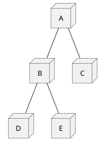
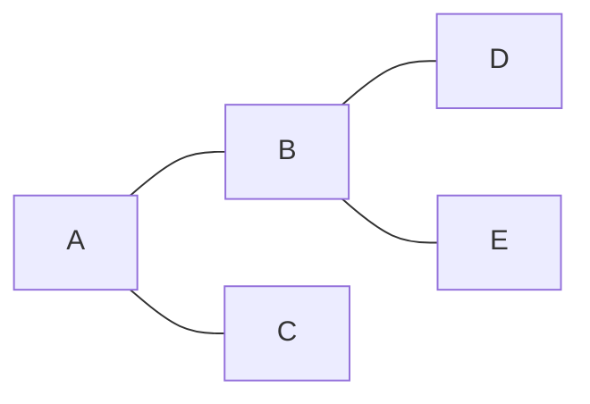
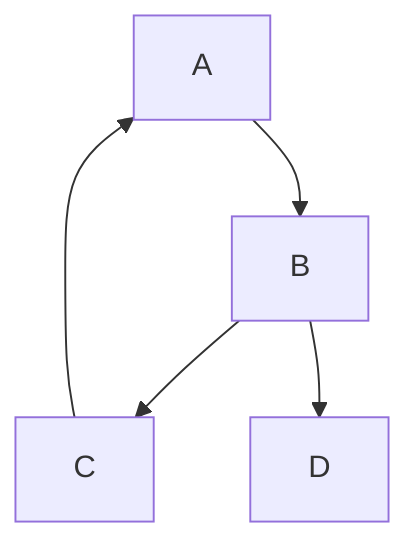

# Lesson: DFS and BFS – Graph Traversal Fundamentals

## 1. Theory

Depth-First Search (DFS) and Breadth-First Search (BFS) are the two fundamental graph traversal algorithms. They systematically visit all vertices and edges of a graph, forming the basis for many more complex algorithms (shortest paths, connectivity, cycle detection, topological sort, etc.).

| Property               | DFS (Depth‑First Search)                     | BFS (Breadth‑First Search)                 |
| ---------------------- | -------------------------------------------- | ------------------------------------------ |
| Traversal order    | Goes as deep as possible along each branch before backtracking | Explores all neighbors level by level (like ripples in water) |
| Data structure     | Stack (explicit or recursion)                | Queue                                      |
| Typical use cases  | Path existence, topological sort, connected components, cycle detection | Shortest path (unweighted), level order, minimum steps |
| Space complexity   | O(V) (recursion stack / explicit stack)      | O(V) (queue)                               |
| Time complexity    | O(V + E) with adjacency list                 | O(V + E) with adjacency list               |
| Optimal for shortest paths | No (may find long path first)           | Yes (unweighted graphs)                    |

Both algorithms work on directed and undirected graphs, with small adaptations (e.g., tracking visited vertices to avoid infinite loops).

---

## 2. Algorithms

### 2.1 DFS – Recursive & Iterative

Recursive DFS (pseudocode for undirected graph):

```js
visited = array of false

function dfs(u):
    visited[u] = true
    // process u (e.g., print, check condition)
    for each neighbor v of u:
        if not visited[v]:
            dfs(v)
```

Iterative DFS (explicit stack):

```js
function dfsIterative(start):
    stack = [start]
    visited[start] = true

    while stack not empty:
        u = stack.pop()
        // process u
        for each neighbor v of u:
            if not visited[v]:
                visited[v] = true
                stack.push(v)
```

> Note: The order of neighbours on the stack affects traversal order (LIFO).

### 2.2 BFS – Iterative (Queue)

```js
function bfs(start):
    queue = [start]
    visited[start] = true

    while queue not empty:
        u = queue.dequeue()
        // process u (level order)
        for each neighbor v of u:
            if not visited[v]:
                visited[v] = true
                queue.enqueue(v)
```

To record distances (shortest path length):

```js
dist = array of infinity
dist[start] = 0
queue = [start]
visited[start] = true

while queue not empty:
    u = queue.dequeue()
    for each neighbor v of u:
        if not visited[v]:
            visited[v] = true
            dist[v] = dist[u] + 1
            queue.enqueue(v)
```

---

## 3. PlantUML Diagrams

### 3.1 DFS Traversal Order (Undirected Graph)





DFS order (starting at A): A, B, D, E, C

### 3.2 BFS Traversal Order (Same Graph)


BFS order: A, B, C, D, E (level by level)

### 3.3 DFS on Directed Graph (with back edge)

```plantuml
@startuml
node A
node B
node C
node D

A --> B
B --> C
C --> A  ' back edge
B --> D
@enduml
```



DFS from A: A → B → C (sees A visited – back edge) → D

---

## 4. Theoretical Questions

1. What is the time complexity of DFS and BFS when the graph is represented as an adjacency matrix?  
   *O(V²) because we need to scan each row of the matrix to find neighbours.*

2. Can BFS be implemented recursively? Why or why not?  
   *BFS is naturally iterative (queue). Recursive BFS would require passing the entire level as a parameter, which is less efficient and not standard. It’s possible but not practical.*

3. How does the choice of data structure (stack vs. queue) affect the traversal order?  
   *Stack (LIFO) gives depth‑first order; queue (FIFO) gives breadth‑first order. The same graph visited with both can produce very different sequences.*

4. What is the minimum number of edges needed to make a connected graph with V vertices?  
   *V-1 (a tree). Both DFS and BFS will visit all vertices in O(V+E) time.*

5. Why does DFS use less memory than BFS on very deep graphs?  
   *DFS only stores the current path (O(depth)), while BFS stores an entire level (O(width)). In a deep, narrow graph, depth ≪ width, so DFS wins.*

---

## 5. Interview Questions

### Easy / Medium

1. Given a graph represented as an adjacency list, write a function `dfsTraversal(start)` that returns a list of vertices in DFS order.  
   *Follow-up: implement both recursive and iterative versions.*

2. Implement BFS to find the shortest path (number of edges) between two nodes in an unweighted graph.  
   *What happens if the graph is disconnected?*

3. Count the number of connected components in an undirected graph using DFS or BFS.  
   *How would you handle a very large graph that doesn’t fit in memory?*

### Hard / Follow‑up

1. Design an algorithm to find all nodes at distance exactly K from a given node using BFS.  
   *How would you do it with DFS? (DFS is less natural but possible with depth‑limited recursion).*

2. Given a 2D grid (maze) with obstacles, use BFS to find the shortest path from top‑left to bottom‑right.  
   *Extend to return the actual path (not just length).*

3. Explain how to detect a cycle in an undirected graph using BFS.  
   *Answer: BFS with parent tracking – if we encounter an already‑visited node that is not the parent, a cycle exists.*

4. Can you use DFS to find the shortest path in an unweighted graph? If yes, how efficient is it compared to BFS?  
   *Yes, by exploring all possible paths (backtracking), but time complexity is exponential O(V! ) in worst case, whereas BFS is O(V+E). So BFS is strongly preferred.*

---

## 6. Follow‑up & Advanced Concepts

- Iterative Deepening DFS (IDDFS): Combines the space efficiency of DFS with the level‑order guarantee of BFS. Useful for large state spaces (e.g., AI puzzles).
- Bidirectional BFS: Start BFS from both source and target; stop when frontiers meet. Reduces complexity from O(b^d) to O(b^(d/2)) for branching factor b and distance d.
- DFS on implicit graphs (backtracking): Classic for problems like N‑Queens, Sudoku, permutations – no explicit graph built, recursion explores state space.
- Graph colouring for BFS levels: BFS naturally colours nodes by distance. This is used in bipartiteness checking (two‑colour BFS).
- Real‑world applications:
  - Web crawling (BFS is polite – respects domain breadth; DFS used for focused crawling).
  - Social network friend suggestions (BFS for degrees of separation).
  - Maze solving (DFS for any path, BFS for shortest).
  - Garbage collection (DFS marks reachable objects).
  - Puzzle solving (15‑puzzle, Rubik’s cube – IDDFS).

---

## 7. LeetCode Practice Problems

### Easy

1. [Find if Path Exists in Graph](https://leetcode.com/problems/find-if-path-exists-in-graph/) – DFS/BFS basic
2. [Binary Tree Inorder Traversal](https://leetcode.com/problems/binary-tree-inorder-traversal/) – DFS on tree
3. [Binary Tree Level Order Traversal](https://leetcode.com/problems/binary-tree-level-order-traversal/) – BFS on tree

### Medium

1. [Number of Islands](https://leetcode.com/problems/number-of-islands/) – DFS/BFS components
2. [Rotting Oranges](https://leetcode.com/problems/rotting-oranges/) – Multi‑source BFS
3. [Course Schedule](https://leetcode.com/problems/course-schedule/) – DFS cycle detection / Kahn’s BFS
4. [Word Ladder](https://leetcode.com/problems/word-ladder/) – BFS shortest path
5. [Pacific Atlantic Water Flow](https://leetcode.com/problems/pacific-atlantic-water-flow/) – DFS/BFS from boundaries
6. [All Paths From Source to Target](https://leetcode.com/problems/all-paths-from-source-to-target/) – DFS backtracking

### Hard

1. [Word Ladder II](https://leetcode.com/problems/word-ladder-ii/) – BFS + DFS for all shortest paths
2. [Alien Dictionary](https://leetcode.com/problems/alien-dictionary/) – Topological sort (BFS Kahn) + cycle detection
3. [Shortest Path in a Grid with Obstacles Elimination](https://leetcode.com/problems/shortest-path-in-a-grid-with-obstacles-elimination/) – BFS with state (row, col, k)
4. [Minimum Number of Days to Eat N Oranges](https://leetcode.com/problems/minimum-number-of-days-to-eat-n-oranges/) – BFS on state space

---

## 8. Code Templates

### DFS (Recursive)

```go
func dfs(u int, adj [][]int, visited []bool) {
    visited[u] = true
    for _, v := range adj[u] {
        if !visited[v] {
            dfs(v, adj, visited)
        }
    }
}
```

```ts
function dfs(u: number, adj: number[][], visited: boolean[]): void {
    visited[u] = true;
    for (const v of adj[u]) {
        if (!visited[v]) {
            dfs(v, adj, visited);
        }
    }
}
```

### DFS (Iterative)

```go
func dfsIterative(start int, adj [][]int) {
    visited := make([]bool, len(adj))
    stack := []int{start}
    visited[start] = true

    for len(stack) > 0 {
        u := stack[len(stack)-1]
        stack = stack[:len(stack)-1]
        for _, v := range adj[u] {
            if !visited[v] {
                visited[v] = true
                stack = append(stack, v)
            }
        }
    }
}
```

```ts
function dfsIterative(start: number, adj: number[][]): void {
    const visited = new Array(adj.length).fill(false);
    const stack: number[] = [start];
    visited[start] = true;

    while (stack.length > 0) {
        const u = stack[stack.length - 1];
        stack.pop();
        for (const v of adj[u]) {
            if (!visited[v]) {
                visited[v] = true;
                stack.push(v);
            }
        }
    }
}
```

### BFS (Shortest Path)

```go
func bfsShortest(start, target int, adj [][]int) int {
    visited := make([]bool, len(adj))
    dist := make([]int, len(adj))
    queue := []int{start}
    visited[start] = true
    dist[start] = 0

    for len(queue) > 0 {
        u := queue[0]
        queue = queue[1:]
        if u == target {
            return dist[u]
        }
        for _, v := range adj[u] {
            if !visited[v] {
                visited[v] = true
                dist[v] = dist[u] + 1
                queue = append(queue, v)
            }
        }
    }
    return -1 // not reachable
}
```

```ts
function bfsShortest(start: number, target: number, adj: number[][]): number {
    const visited = new Array(adj.length).fill(false);
    const dist = new Array(adj.length).fill(-1);
    const queue: number[] = [start];
    visited[start] = true;
    dist[start] = 0;

    while (queue.length > 0) {
        const u = queue.shift()!;
        if (u === target) return dist[u];
        for (const v of adj[u]) {
            if (!visited[v]) {
                visited[v] = true;
                dist[v] = dist[u] + 1;
                queue.push(v);
            }
        }
    }
    return -1; // not reachable
}
```

---

## Summary

- DFS uses a stack (recursion or explicit)od for deep exploration, cycle detection, topological sort.
- BFS uses a queue – optimal for shortest paths in unweighted graphs, level‑order traversal.
- Both run in O(V+E) time with adjacency lists and O(V) space.
- Choose based on problem requirements: shortest path → BFS; any path / backtracking → DFS.

> Pro tip: In interviews, always clarify whether the graph is directed/undirected, weighted/unweighted, and if you need the path or just existence.
