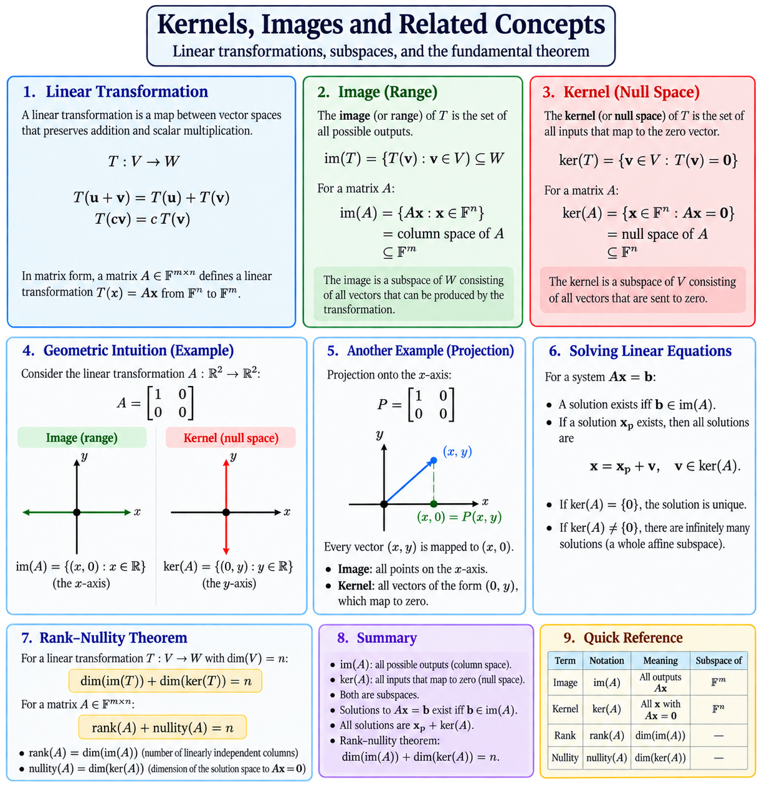

# Kernels, Images, and Related Linear

---

## 1. Linear transformation

A linear transformation is a map between vector spaces: `T : V → W`

It preserves vector addition and scalar multiplication: `T(u + v) = T(u) + T(v)` and `T(cv) = cT(v)`.

For a matrix `A ∈ Fᵐˣⁿ`: `T(x) = Ax`, where `A : Fⁿ → Fᵐ`.

---

## 2. Image (range)

The image of `T` is the set of all possible outputs: `im(T) = { T(v) : v ∈ V } ⊆ W`.

For a matrix: `im(A) = { Ax : x ∈ Fⁿ }`.

This is also called the column space of `A`.

If `A = [A₁ A₂ … Aₙ]`, then `Ax = x₁A₁ + x₂A₂ + … + xₙAₙ`.

Therefore, `im(A) = span{A₁, A₂, …, Aₙ}`.

### Intuition

Image = everything the transformation can produce.

---

## 3. Kernel (null space)

The kernel of `T` is the set of all vectors that are mapped to the zero vector: `ker(T) = { v ∈ V : T(v) = 0 }`.

For a matrix: `ker(A) = { x ∈ Fⁿ : Ax = 0 }`.

This is also called the null space of `A`.

### Intuition

Kernel = everything the transformation completely collapses to zero.

---

## 4. Example

Consider the matrix `A = [1 0; 0 0]`.

For the vector `x = (x, y)`, we have `Ax = (x, 0)`.

### Image

Every output has the form `(x, 0)`.

Therefore, `im(A) = { (x, 0) : x ∈ F }`.

The image is the x-axis.

### Kernel

For `Ax = 0`, `(x, 0) = (0, 0)`, so `x = 0`, while `y` can be arbitrary.

Thus, `ker(A) = { (0, y) : y ∈ F }`.

The kernel is the y-axis.

---

## 5. Image and kernel live in different spaces

For `A : Fⁿ → Fᵐ`, the two spaces are `ker(A) ⊆ Fⁿ` and `im(A) ⊆ Fᵐ`.

This distinction is important:

- Kernel: a subspace of the domain.
- Image: a subspace of the codomain.

---

## 6. Solving a linear system

Consider `Ax = b`.

The equation asks: `Find x such that Ax = b`.

In vector-space language: `Find the preimage of b under A`.

### Existence

A solution exists exactly when `b ∈ im(A)`.

If `b` is not in the image, no vector `x` can produce it.

### All solutions

If `xₚ` is one particular solution, then every solution is `x = xₚ + v`, where `v ∈ ker(A)`.

Indeed, `A(xₚ + v) = Axₚ + Av = b + 0 = b`.

Therefore, the solution set is the affine subspace `xₚ + ker(A)`.

---

## 7. Uniqueness

The system `Ax = b` has at most one solution exactly when `ker(A) = {0}`.

If a solution exists, `ker(A) = {0} ⇔ the solution is unique`.

If `ker(A) ≠ {0}`, then any nonzero `v ∈ ker(A)` gives another solution `xₚ + v`.

Over an infinite field such as `ℝ`, this gives infinitely many solutions.

---

## 8. Rank and nullity

The rank of `A` is the dimension of its image: `rank(A) = dim(im(A))`.

The nullity of `A` is the dimension of its kernel: `nullity(A) = dim(ker(A))`.

For `A : Fⁿ → Fᵐ`, the rank–nullity theorem says: `rank(A) + nullity(A) = n`.

Here, `n = dim(Fⁿ)`, the dimension of the domain.

Equivalently: `dim(im(A)) + dim(ker(A)) = dim(Fⁿ)`.

---

## 9. A useful mental model

Think of a linear transformation as a machine: `input space → A → output space`.

The kernel answers: Which inputs disappear completely? `x → 0`.

The image answers: Which outputs can the machine produce? `x → Ax`.

For a system `Ax = b`, the questions become:

1. Can `b` be produced? Check `b ∈ im(A)`.
2. If it can, how many inputs produce it? Look at `ker(A)`.
3. What are all those inputs? `x = xₚ + ker(A)`.

---

## 10. Quick reference

| Concept | Notation | Meaning | Lives in |
| --- | --- | --- | --- |
| Linear transformation | `A : Fⁿ → Fᵐ` | Maps vectors linearly | — |
| Image / range | `im(A)` | All possible outputs `Ax` | `Fᵐ` |
| Kernel / null space | `ker(A)` | All `x` with `Ax = 0` | `Fⁿ` |
| Rank | `rank(A)` | `dim(im(A))` | — |
| Nullity | `nullity(A)` | `dim(ker(A))` | — |
| Solution of `Ax = b` | `xₚ + ker(A)` | All inputs producing `b` | `Fⁿ` |

### Core relationships

`im(A) = span{columns of A}`

`ker(A) = {x : Ax = 0}`

`Ax = b` has a solution ⇔ `b ∈ im(A)`

`All solutions = xₚ + ker(A)`

`rank(A) + nullity(A) = n`

----

# ai/chatgpt
